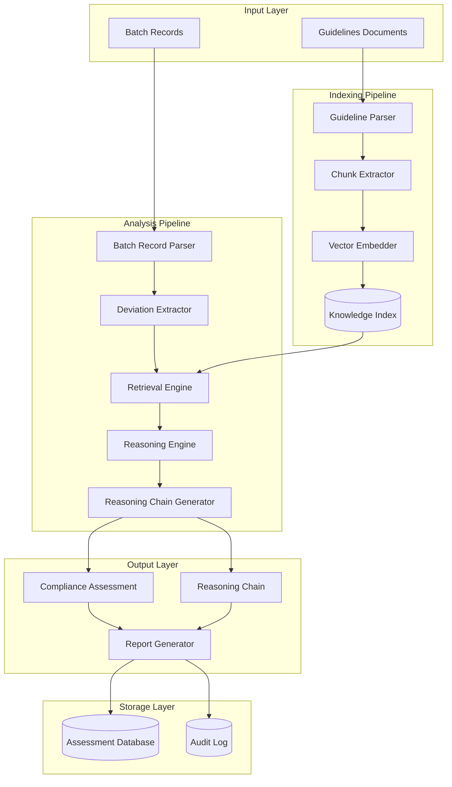

# Design Document: YuktiAI Compliance Investigator

## Overview

YuktiAI is an AI-powered compliance investigation system for pharmaceutical manufacturing that uses Retrieval-Augmented Generation (RAG) to assess deviations against regulatory guidelines. The system combines vector-based semantic search with large language model reasoning to provide transparent, auditable compliance assessments.

### Core Capabilities
- Index and semantically search CDSCO Schedule M and FDA Part 211 guidelines
- Parse structured and unstructured batch manufacturing records
- Perform multifactorial compliance analysis using AI reasoning
- Generate transparent reasoning chains (Yukti) for every assessment
- Produce comprehensive compliance reports with full traceability

### Design Philosophy
Unlike rule-based compliance systems that perform binary matching, YuktiAI understands regulatory intent through semantic analysis. Every assessment includes a reasoning chain that explains the decision-making process, making the system auditable and trustworthy for regulatory inspections.

## Architecture

### High-Level Architecture



### Component Responsibilities

**Indexing Pipeline:**
- Guideline Parser: Extracts structured content from regulatory documents
- Chunk Extractor: Segments guidelines into semantically meaningful chunks
- Vector Embedder: Generates embeddings for semantic search
- Knowledge Index: Vector database storing guideline embeddings with metadata

**Analysis Pipeline:**
- Batch Record Parser: Extracts structured data from manufacturing records
- Deviation Extractor: Identifies and normalizes deviation entries
- Retrieval Engine: Finds relevant guidelines using semantic similarity
- Reasoning Engine: Performs AI-powered compliance analysis
- Reasoning Chain Generator: Creates transparent explanation of assessment

**Storage Layer:**
- Assessment Database: Stores compliance assessments with full context
- Audit Log: Maintains immutable record of all system actions

## Components and Interfaces

### 1. Guideline Parser

**Purpose:** Parse regulatory guideline documents and extract structured compliance requirements.

**Interface:**
```python
class GuidelineParser:
    def parse_document(self, document: Document) -> ParsedGuideline:
        """
        Parse a regulatory guideline document.
        
        Args:
            document: Raw guideline document (PDF, HTML, or text)
            
        Returns:
            ParsedGuideline with structured sections and metadata
            
        Raises:
            ParseError: If document format is unsupported or malformed
        """
        pass
    
    def extract_requirements(self, parsed: ParsedGuideline) -> List[Requirement]:
        """
        Extract individual compliance requirements from parsed guideline.
        
        Args:
            parsed: Parsed guideline structure
            
        Returns:
            List of individual requirements with context
        """
        pass
```

**Key Behaviors:**
- Supports PDF, HTML, and plain text formats
- Preserves document structure (sections, subsections, numbering)
- Extracts metadata (version, effective date, authority)
- Identifies requirement statements vs. explanatory text

### 2. Chunk Extractor

**Purpose:** Segment guidelines into semantically coherent chunks for vector indexing.

**Interface:**
```python
class ChunkExtractor:
    def extract_chunks(
        self, 
        requirements: List[Requirement],
        chunk_size: int = 512,
        overlap: int = 50
    ) -> List[GuidelineChunk]:
        """
        Create overlapping chunks from requirements for embedding.
        
        Args:
            requirements: List of parsed requirements
            chunk_size: Target token count per chunk
            overlap: Token overlap between chunks
            
        Returns:
            List of chunks with preserved context and metadata
        """
        pass
```

**Key Behaviors:**
- Maintains semantic boundaries (doesn't split mid-sentence)
- Preserves requirement context in each chunk
- Includes metadata (source section, requirement ID, version)
- Creates overlapping chunks to avoid context loss at boundaries

### 3. Vector Embedder

**Purpose:** Generate vector embeddings for semantic search.

**Interface:**
```python
class VectorEmbedder:
    def embed_chunks(self, chunks: List[GuidelineChunk]) -> List[EmbeddedChunk]:
        """
        Generate vector embeddings for guideline chunks.
        
        Args:
            chunks: List of text chunks to embed
            
        Returns:
            List of chunks with vector embeddings
        """
        pass
    
    def embed_query(self, query: str) -> Vector:
        """
        Generate embedding for a search query.
        
        Args:
            query: Query text (typically a deviation description)
            
        Returns:
            Query vector for similarity search
        """
        pass
```

**Key Behaviors:**
- Uses domain-specific embedding model (e.g., fine-tuned on regulatory text)
- Normalizes vectors for cosine similarity
- Batches embedding requests for efficiency
- Caches embeddings to avoid recomputation

### 4. Knowledge Index

**Purpose:** Store and retrieve guideline embeddings with metadata.

**Interface:**
```python
class KnowledgeIndex:
    def index_chunks(self, embedded_chunks: List[EmbeddedChunk]) -> None:
        """
        Add embedded chunks to the vector index.
        
        Args:
            embedded_chunks: Chunks with embeddings and metadata
        """
        pass
    
    def search(
        self, 
        query_vector: Vector, 
        top_k: int = 5,
        filters: Optional[Dict] = None
    ) -> List[SearchResult]:
        """
        Retrieve most relevant guidelines for a query.
        
        Args:
            query_vector: Embedded query vector
            top_k: Number of results to return
            filters: Optional metadata filters (e.g., guideline version)
            
        Returns:
            Ranked list of relevant guideline chunks with similarity scores
        """
        pass
    
    def get_guideline_version(self, guideline_id: str) -> GuidelineVersion:
        """
        Retrieve version information for a guideline.
        
        Args:
            guideline_id: Unique identifier for guideline
            
        Returns:
            Version metadata including effective date
        """
        pass
```

**Key Behaviors:**
- Supports vector similarity search (cosine similarity)
- Allows filtering by guideline source, version, effective date
- Maintains version history for all guidelines
- Provides fast retrieval (< 100ms for typical queries)

### 5. Batch Record Parser

**Purpose:** Parse batch manufacturing records and extract structured data.

**Interface:**
```python
class BatchRecordParser:
    def parse_record(self, record: BatchRecord) -> ParsedBatchRecord:
        """
        Parse a batch manufacturing record.
        
        Args:
            record: Raw batch record (JSON, XML, or structured text)
            
        Returns:
            Parsed batch record with structured fields
            
        Raises:
            ParseError: If record is malformed or missing required fields
        """
        pass
    
    def validate_record(self, record: BatchRecord) -> ValidationResult:
        """
        Validate batch record completeness before parsing.
        
        Args:
            record: Raw batch record
            
        Returns:
            Validation result with specific error messages if invalid
        """
        pass
```

**Key Behaviors:**
- Supports JSON, XML, and structured text formats
- Validates required fields (batch ID, timestamps, process parameters)
- Handles both structured and unstructured deviation descriptions
- Provides detailed error messages for malformed records

### 6. Deviation Extractor

**Purpose:** Extract and normalize deviation entries from parsed batch records.

**Interface:**
```python
class DeviationExtractor:
    def extract_deviations(self, parsed_record: ParsedBatchRecord) -> List[Deviation]:
        """
        Extract all deviations from a parsed batch record.
        
        Args:
            parsed_record: Parsed batch record structure
            
        Returns:
            List of normalized deviation objects
        """
        pass
    
    def normalize_deviation(self, raw_deviation: Dict) -> Deviation:
        """
        Normalize a deviation entry to standard format.
        
        Args:
            raw_deviation: Raw deviation data from batch record
            
        Returns:
            Normalized deviation with standardized fields
        """
        pass
```

**Key Behaviors:**
- Extracts deviation description, timestamp, process context
- Normalizes timestamps to ISO 8601 format
- Handles multiple deviations per batch record
- Preserves original deviation text for audit trail

### 7. Retrieval Engine

**Purpose:** Find relevant guidelines for a given deviation using semantic search.

**Interface:**
```python
class RetrievalEngine:
    def retrieve_guidelines(
        self, 
        deviation: Deviation,
        top_k: int = 5
    ) -> List[RelevantGuideline]:
        """
        Retrieve guidelines relevant to a deviation.
        
        Args:
            deviation: Deviation to analyze
            top_k: Number of guidelines to retrieve
            
        Returns:
            Ranked list of relevant guidelines with similarity scores
        """
        pass
    
    def expand_context(
        self, 
        guidelines: List[RelevantGuideline]
    ) -> List[GuidelineWithContext]:
        """
        Expand retrieved guidelines with surrounding context.
        
        Args:
            guidelines: Initially retrieved guideline chunks
            
        Returns:
            Guidelines with expanded context from adjacent chunks
        """
        pass
```

**Key Behaviors:**
- Embeds deviation description for semantic search
- Retrieves top-k most similar guideline chunks
- Expands context by including adjacent chunks
- Ranks results by semantic similarity score

### 8. Reasoning Engine

**Purpose:** Perform AI-powered compliance analysis using retrieved guidelines.

**Interface:**
```python
class ReasoningEngine:
    def analyze_deviation(
        self, 
        deviation: Deviation,
        guidelines: List[GuidelineWithContext]
    ) -> ComplianceAnalysis:
        """
        Analyze a deviation against relevant guidelines.
        
        Args:
            deviation: Deviation to assess
            guidelines: Retrieved relevant guidelines
            
        Returns:
            Compliance analysis with classification and reasoning
        """
        pass
    
    def classify_severity(
        self, 
        analysis: ComplianceAnalysis
    ) -> SeverityClassification:
        """
        Classify deviation severity based on analysis.
        
        Args:
            analysis: Completed compliance analysis
            
        Returns:
            Classification as Minor Incident or Critical Non-Compliance
        """
        pass
    
    def calculate_confidence(
        self, 
        analysis: ComplianceAnalysis
    ) -> float:
        """
        Calculate confidence score for the assessment.
        
        Args:
            analysis: Completed compliance analysis
            
        Returns:
            Confidence score between 0.0 and 1.0
        """
        pass
```

**Key Behaviors:**
- Uses LLM to understand regulatory intent
- Considers multiple factors: severity, patient safety, regulatory context
- Applies most stringent standard when multiple guidelines apply
- Generates confidence score based on guideline relevance and clarity
- Flags low-confidence assessments for human review

### 9. Reasoning Chain Generator

**Purpose:** Generate transparent explanations for compliance assessments.

**Interface:**
```python
class ReasoningChainGenerator:
    def generate_chain(
        self, 
        deviation: Deviation,
        analysis: ComplianceAnalysis,
        guidelines: List[GuidelineWithContext]
    ) -> ReasoningChain:
        """
        Generate a reasoning chain explaining the assessment.
        
        Args:
            deviation: Original deviation
            analysis: Compliance analysis result
            guidelines: Guidelines used in analysis
            
        Returns:
            Structured reasoning chain with citations
        """
        pass
    
    def format_for_audit(self, chain: ReasoningChain) -> str:
        """
        Format reasoning chain for audit documentation.
        
        Args:
            chain: Reasoning chain structure
            
        Returns:
            Human-readable formatted explanation
        """
        pass
```

**Key Behaviors:**
- Cites specific guideline sections (e.g., "FDA Part 211.100(a)")
- Explains which factors influenced severity classification
- States patient safety or quality risks for critical findings
- Includes confidence score and flags for human review
- Maintains traceability to source guidelines

### 10. Report Generator

**Purpose:** Generate comprehensive compliance reports.

**Interface:**
```python
class ReportGenerator:
    def generate_report(
        self, 
        assessments: List[ComplianceAssessment]
    ) -> ComplianceReport:
        """
        Generate a compliance report from assessments.
        
        Args:
            assessments: List of completed compliance assessments
            
        Returns:
            Structured compliance report
        """
        pass
    
    def format_report(
        self, 
        report: ComplianceReport,
        format: ReportFormat
    ) -> str:
        """
        Format report for output.
        
        Args:
            report: Structured report data
            format: Output format (PDF, HTML, JSON)
            
        Returns:
            Formatted report string
        """
        pass
```

**Key Behaviors:**
- Separates critical findings from minor incidents
- Includes all reasoning chains
- Provides summary statistics
- Supports multiple output formats (PDF, HTML, JSON)
- Includes guideline references for each finding

## Data Models

### Core Data Structures

```python
@dataclass
class Document:
    """Raw guideline document."""
    content: str
    format: str  # 'pdf', 'html', 'text'
    source: str  # 'CDSCO' or 'FDA'
    metadata: Dict[str, Any]

@dataclass
class ParsedGuideline:
    """Parsed guideline structure."""
    guideline_id: str
    title: str
    version: str
    effective_date: datetime
    source: str  # 'CDSCO Schedule M' or 'FDA Part 211'
    sections: List[Section]
    metadata: Dict[str, Any]

@dataclass
class Section:
    """Guideline section."""
    section_id: str  # e.g., "211.100(a)"
    title: str
    content: str
    subsections: List['Section']

@dataclass
class Requirement:
    """Individual compliance requirement."""
    requirement_id: str
    section_id: str
    text: str
    intent: str  # Extracted regulatory intent
    source_guideline: str
    version: str

@dataclass
class GuidelineChunk:
    """Chunk of guideline text for embedding."""
    chunk_id: str
    text: str
    requirement_ids: List[str]
    section_id: str
    source_guideline: str
    version: str
    metadata: Dict[str, Any]

@dataclass
class EmbeddedChunk:
    """Guideline chunk with vector embedding."""
    chunk: GuidelineChunk
    embedding: Vector  # numpy array or list of floats
    
@dataclass
class Vector:
    """Vector representation."""
    values: List[float]
    dimension: int

@dataclass
class SearchResult:
    """Search result from knowledge index."""
    chunk: GuidelineChunk
    similarity_score: float
    rank: int

@dataclass
class BatchRecord:
    """Raw batch manufacturing record."""
    batch_id: str
    product: str
    manufacturing_date: datetime
    content: str
    format: str  # 'json', 'xml', 'text'

@dataclass
class ParsedBatchRecord:
    """Parsed batch record."""
    batch_id: str
    product: str
    manufacturing_date: datetime
    process_parameters: Dict[str, Any]
    deviations: List[Dict[str, Any]]  # Raw deviation entries

@dataclass
class Deviation:
    """Normalized deviation."""
    deviation_id: str
    batch_id: str
    description: str
    timestamp: datetime
    process_context: Dict[str, Any]
    original_text: str  # Preserved for audit

@dataclass
class RelevantGuideline:
    """Retrieved guideline with relevance score."""
    chunk: GuidelineChunk
    similarity_score: float
    rank: int

@dataclass
class GuidelineWithContext:
    """Guideline with expanded context."""
    primary_chunk: GuidelineChunk
    context_chunks: List[GuidelineChunk]  # Adjacent chunks
    similarity_score: float

@dataclass
class ComplianceAnalysis:
    """Result of compliance analysis."""
    deviation: Deviation
    relevant_guidelines: List[GuidelineWithContext]
    factors_considered: List[str]
    severity_rationale: str
    patient_safety_impact: Optional[str]
    quality_risk: Optional[str]
    conflicting_guidelines: List[str]  # If any conflicts found

@dataclass
class SeverityClassification:
    """Severity classification result."""
    classification: str  # 'Minor Incident' or 'Critical Non-Compliance'
    confidence: float  # 0.0 to 1.0
    requires_human_review: bool

@dataclass
class ReasoningChain:
    """Transparent reasoning explanation."""
    deviation_summary: str
    guidelines_cited: List[str]  # e.g., ["FDA Part 211.100(a)", "CDSCO Schedule M 3.2"]
    factors_explained: List[str]
    severity_justification: str
    patient_safety_statement: Optional[str]
    confidence_score: float
    flags: List[str]  # e.g., ["LOW_CONFIDENCE", "CONFLICTING_GUIDELINES"]
    model_version: str

@dataclass
class ComplianceAssessment:
    """Complete compliance assessment."""
    assessment_id: str
    deviation: Deviation
    classification: SeverityClassification
    reasoning_chain: ReasoningChain
    timestamp: datetime
    guideline_versions: Dict[str, str]  # guideline_id -> version
    model_version: str

@dataclass
class ComplianceReport:
    """Comprehensive compliance report."""
    report_id: str
    batch_records: List[str]  # batch IDs
    assessments: List[ComplianceAssessment]
    critical_findings: List[ComplianceAssessment]
    minor_incidents: List[ComplianceAssessment]
    summary_statistics: Dict[str, Any]
    generated_at: datetime

@dataclass
class ValidationResult:
    """Validation result for batch records."""
    is_valid: bool
    errors: List[str]
    warnings: List[str]

@dataclass
class GuidelineVersion:
    """Guideline version metadata."""
    guideline_id: str
    version: str
    effective_date: datetime
    superseded_by: Optional[str]  # Next version ID if superseded
    source: str
```

## Correctness Properties


A property is a characteristic or behavior that should hold true across all valid executions of a system—essentially, a formal statement about what the system should do. Properties serve as the bridge between human-readable specifications and machine-verifiable correctness guarantees.

### Guideline Indexing Properties

**Property 1: Complete guideline extraction**
*For any* guideline document that is indexed, the system should extract both compliance requirements and their regulatory intent, and maintain source references for traceability.
**Validates: Requirements 1.3, 1.4**

**Property 2: Semantic retrieval accuracy**
*For any* deviation query, the retrieval engine should return guidelines that are semantically relevant to the deviation context.
**Validates: Requirements 1.5**

### Batch Record Parsing Properties

**Property 3: Complete deviation extraction**
*For any* valid batch record, the parser should extract all deviations with their descriptions, timestamps, and process parameters.
**Validates: Requirements 2.1, 2.2**

**Property 4: Independent deviation processing**
*For any* batch record containing N deviations, the system should produce exactly N independent deviation objects.
**Validates: Requirements 2.3**

**Property 5: Malformed record rejection**
*For any* malformed or incomplete batch record, the system should return a descriptive error indicating the specific missing or invalid fields.
**Validates: Requirements 2.4**

### Compliance Analysis Properties

**Property 6: Guideline-backed analysis**
*For any* deviation analysis, the system should retrieve and reference relevant guidelines from the knowledge index.
**Validates: Requirements 3.1**

**Property 7: Multifactorial reasoning**
*For any* compliance analysis, the reasoning should consider severity, patient safety impact, regulatory context, and guideline intent.
**Validates: Requirements 3.2, 3.3**

**Property 8: Valid classification output**
*For any* deviation, the system should classify it as exactly one of: "Minor Incident" or "Critical Non-Compliance".
**Validates: Requirements 3.4**

**Property 9: Most stringent standard application**
*For any* deviation that matches multiple guidelines, the final classification should reflect the most stringent applicable standard.
**Validates: Requirements 3.5**

### Reasoning Chain Properties

**Property 10: Complete reasoning chain structure**
*For any* compliance assessment, the reasoning chain should include: guideline citations, factor explanations, severity justification, and properly formatted section references (e.g., "FDA Part 211.100(a)").
**Validates: Requirements 4.1, 4.2, 4.3, 4.4**

**Property 11: Critical finding risk statements**
*For any* deviation classified as "Critical Non-Compliance", the reasoning chain should explicitly state patient safety or quality risks.
**Validates: Requirements 4.5**

### Synthetic Data Properties

**Property 12: Synthetic data acceptance**
*For any* synthetic batch record that conforms to the batch record schema, the system should process it without errors.
**Validates: Requirements 5.1**

**Property 13: Analysis consistency across data sources**
*For any* pair of equivalent synthetic and production batch records, the compliance analysis should produce consistent classifications and reasoning.
**Validates: Requirements 5.2**

**Property 14: Batch processing support**
*For any* list of batch records (synthetic or production), the system should process all records and produce assessments for each.
**Validates: Requirements 5.3**

### Compliance Report Properties

**Property 15: Complete report structure**
*For any* set of compliance assessments, the generated report should include: all assessed deviations, their classifications, their reasoning chains, guideline references, and separate sections for critical vs. minor findings.
**Validates: Requirements 6.1, 6.2, 6.3, 6.4, 6.5**

### Traceability Properties

**Property 16: Complete assessment metadata**
*For any* compliance assessment, the system should record: analysis timestamp, guideline versions used, AI model version, and preserve the original batch record data.
**Validates: Requirements 7.1, 7.2, 7.3, 7.4**

### Guideline Update Properties

**Property 17: Guideline addition support**
*For any* new guideline document, the system should successfully add it to the knowledge index with proper versioning.
**Validates: Requirements 8.1**

**Property 18: Version history preservation**
*For any* guideline update, all previous versions should remain accessible in the knowledge index.
**Validates: Requirements 8.2**

**Property 19: Historical version selection**
*For any* analysis request specifying a guideline version, the system should use exactly that version for retrieval and reasoning.
**Validates: Requirements 8.3**

**Property 20: Update impact flagging**
*For any* guideline update, the system should identify and flag all previous assessments that referenced the updated guideline.
**Validates: Requirements 8.4**

### Edge Case Handling Properties

**Property 21: Low confidence flagging**
*For any* assessment with confidence score below a threshold (e.g., 0.7), the system should flag it for human review.
**Validates: Requirements 9.1**

**Property 22: Conflict documentation**
*For any* deviation where multiple retrieved guidelines provide conflicting guidance, the reasoning chain should explicitly document the conflict.
**Validates: Requirements 9.2**

**Property 23: Missing context indication**
*For any* deviation where no relevant guidelines are found (similarity score below threshold), the system should indicate insufficient regulatory context.
**Validates: Requirements 9.3**

**Property 24: Confidence score presence**
*For any* compliance assessment, the output should include a confidence score between 0.0 and 1.0.
**Validates: Requirements 9.4**

### Security Properties

**Property 25: Local processing guarantee**
*For any* batch record processing operation, the system should complete without making external network calls to third-party services.
**Validates: Requirements 10.1**

**Property 26: Encryption at rest**
*For any* batch record stored in the database, the data should be encrypted using a secure encryption algorithm.
**Validates: Requirements 10.2**

**Property 27: Audit log completeness**
*For any* compliance assessment operation, there should be a corresponding entry in the access log with timestamp and operation details.
**Validates: Requirements 10.3**

**Property 28: Retention policy enforcement**
*For any* record older than the configured retention period, the system should automatically delete it during the next cleanup cycle.
**Validates: Requirements 10.4**

## Error Handling

### Error Categories

**1. Input Validation Errors**
- Malformed batch records (missing required fields)
- Unsupported document formats
- Invalid guideline documents
- Schema validation failures

**Error Response:**
```python
@dataclass
class ValidationError:
    error_type: str  # 'MALFORMED_RECORD', 'INVALID_FORMAT', etc.
    message: str
    field_errors: List[FieldError]
    
@dataclass
class FieldError:
    field_name: str
    error_message: str
    expected_format: Optional[str]
```

**2. Processing Errors**
- Embedding generation failures
- Vector search failures
- LLM API errors
- Database connection errors

**Error Handling Strategy:**
- Retry transient errors (network, API rate limits) with exponential backoff
- Log all errors with full context for debugging
- Return descriptive error messages to users
- Maintain system state consistency (rollback on failure)

**3. Analysis Errors**
- No relevant guidelines found
- Conflicting guidelines
- Low confidence assessments
- Ambiguous deviations

**Error Handling Strategy:**
- Flag for human review rather than failing
- Document the issue in reasoning chain
- Provide partial results when possible
- Include confidence scores and uncertainty indicators

### Error Recovery

**Graceful Degradation:**
- If vector search fails, fall back to keyword search
- If LLM is unavailable, queue for later processing
- If embedding model fails, use cached embeddings when available

**Audit Trail:**
- Log all errors with timestamps
- Include error context (input data, system state)
- Track error resolution (human review, retry success)

## Testing Strategy

### Dual Testing Approach

This system requires both unit testing and property-based testing for comprehensive coverage:

**Unit Tests** focus on:
- Specific examples of guideline parsing (CDSCO Schedule M, FDA Part 211)
- Edge cases (empty batch records, malformed JSON)
- Error conditions (network failures, invalid inputs)
- Integration points (database connections, LLM API calls)

**Property-Based Tests** focus on:
- Universal properties across all inputs (see Correctness Properties section)
- Comprehensive input coverage through randomization
- Invariants that must hold for all valid data

### Property-Based Testing Configuration

**Framework:** Use `hypothesis` (Python) for property-based testing

**Test Configuration:**
- Minimum 100 iterations per property test
- Each test tagged with: **Feature: yuktiai-compliance-investigator, Property {number}: {property_text}**
- Custom generators for domain objects (batch records, guidelines, deviations)

**Example Property Test Structure:**
```python
from hypothesis import given, strategies as st
import pytest

@given(batch_record=batch_record_strategy())
@pytest.mark.property_test
@pytest.mark.tag("Feature: yuktiai-compliance-investigator, Property 3: Complete deviation extraction")
def test_complete_deviation_extraction(batch_record):
    """
    Property 3: For any valid batch record, the parser should extract 
    all deviations with their descriptions, timestamps, and process parameters.
    """
    parser = BatchRecordParser()
    parsed = parser.parse_record(batch_record)
    extractor = DeviationExtractor()
    deviations = extractor.extract_deviations(parsed)
    
    # Verify all deviations extracted
    assert len(deviations) == len(parsed.deviations)
    
    # Verify completeness of each deviation
    for deviation in deviations:
        assert deviation.description is not None
        assert deviation.timestamp is not None
        assert deviation.process_context is not None
```

### Custom Generators

**Domain-Specific Generators:**
```python
@st.composite
def batch_record_strategy(draw):
    """Generate random valid batch records."""
    return BatchRecord(
        batch_id=draw(st.text(min_size=1, max_size=20)),
        product=draw(st.text(min_size=1, max_size=50)),
        manufacturing_date=draw(st.datetimes()),
        content=draw(st.json()),
        format=draw(st.sampled_from(['json', 'xml', 'text']))
    )

@st.composite
def deviation_strategy(draw):
    """Generate random deviations."""
    return Deviation(
        deviation_id=draw(st.uuids()).hex,
        batch_id=draw(st.text(min_size=1, max_size=20)),
        description=draw(st.text(min_size=10, max_size=500)),
        timestamp=draw(st.datetimes()),
        process_context=draw(st.dictionaries(st.text(), st.text())),
        original_text=draw(st.text(min_size=10, max_size=500))
    )

@st.composite
def guideline_chunk_strategy(draw):
    """Generate random guideline chunks."""
    return GuidelineChunk(
        chunk_id=draw(st.uuids()).hex,
        text=draw(st.text(min_size=50, max_size=1000)),
        requirement_ids=draw(st.lists(st.text(), min_size=1, max_size=5)),
        section_id=draw(st.text(min_size=1, max_size=20)),
        source_guideline=draw(st.sampled_from(['CDSCO Schedule M', 'FDA Part 211'])),
        version=draw(st.text(min_size=1, max_size=10)),
        metadata=draw(st.dictionaries(st.text(), st.text()))
    )
```

### Integration Testing

**End-to-End Scenarios:**
1. Index guidelines → Parse batch record → Analyze deviations → Generate report
2. Update guideline → Re-analyze affected deviations → Verify flagging
3. Process synthetic data batch → Verify all assessments complete
4. Low confidence scenario → Verify human review flag

**Test Data:**
- Real CDSCO Schedule M excerpts (publicly available)
- Real FDA Part 211 excerpts (publicly available)
- Synthetic batch records with known deviations
- Edge cases (empty records, conflicting guidelines, ambiguous deviations)

### Performance Testing

**Benchmarks:**
- Guideline indexing: < 5 seconds per document
- Batch record parsing: < 1 second per record
- Deviation analysis: < 10 seconds per deviation
- Report generation: < 5 seconds for 100 assessments
- Vector search: < 100ms per query

**Load Testing:**
- Batch processing: 1000 batch records in < 30 minutes
- Concurrent analysis: 10 simultaneous deviation analyses
- Index size: Support 10,000+ guideline chunks

### Security Testing

**Test Cases:**
- Verify no external network calls during processing
- Verify encryption at rest for stored records
- Verify access logs created for all operations
- Verify data retention policy enforcement
- Test SQL injection prevention
- Test input sanitization

### Validation Testing

**Regulatory Compliance:**
- Test with known compliance scenarios (documented cases)
- Validate reasoning chains with domain experts
- Compare against manual compliance assessments
- Verify guideline citation accuracy
